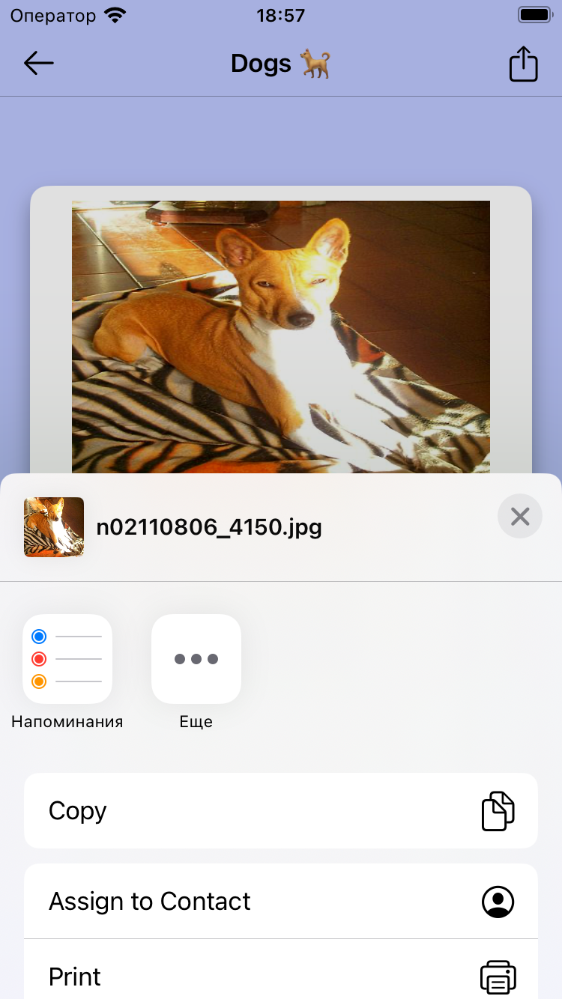

# Animal Facts

## A simple application that allows users to see a list of animal categories and read interesting facts about them.

## About
- **Developed in Swift.**
- **Applied TCA architecture.**
- **Built with SwiftUI.**
- **Used async/await for async tasks.**
- **Implemented Dependency Injection (DI).**
- **Compatible with iOS 16+.**
### Note
I intentionally did not use AsyncImage to showcase my ability to work with asynchronous data and to demonstrate how I can adapt the layout for scenarios involving such data.

|| Categories List | Facts List | Share |
| --- | --- | --- | --- |
| **Touch ID** |  |  |  |
| **Dynamic Island** |  |  |  |
| **iPad** |  |  |  |

## Functionality 

- The app begins by loading content from this link at launch, which contains JSON data structured with titles, descriptions, images, order, status, and associated facts.
### Application Screens
#### Animal Categories List
- Displays a sorted list of animal categories with images, names, descriptions, and status (free, paid, or coming soon).
Loading state is shown until content is fully loaded.
Users can navigate to the Facts Screen by tapping on free items, or they can watch an ad to unlock paid items. Coming soon items trigger an alert.

#### Facts Screen
- Features a navigation bar, a horizontal paging list of facts, and Next/Previous buttons for navigation.
Users can swipe or use buttons to navigate between facts, and can return to the Animal Categories List via the Back button.

## Original Technical Requirements
[Here](https://github.com/AppSci/promova-test-task-iOS)
